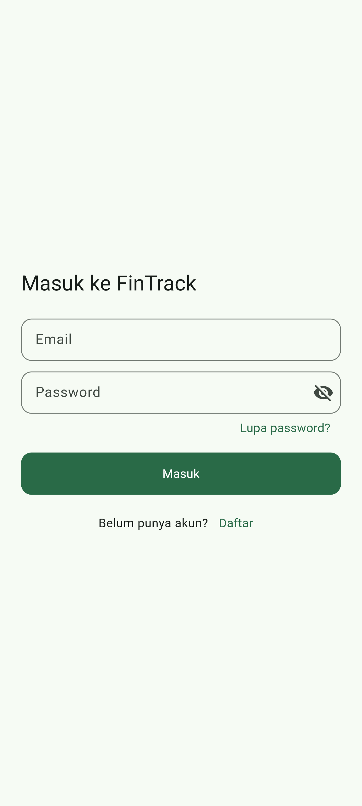
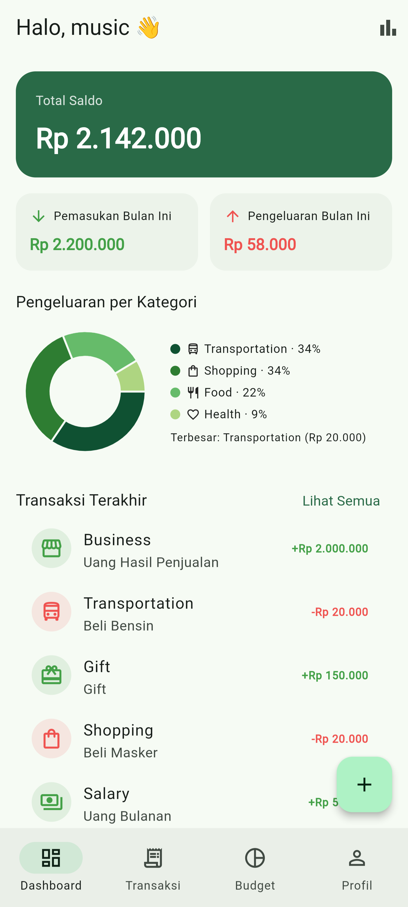
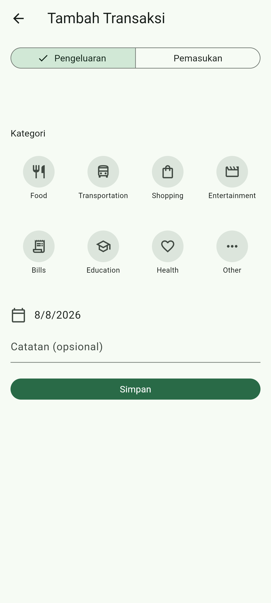
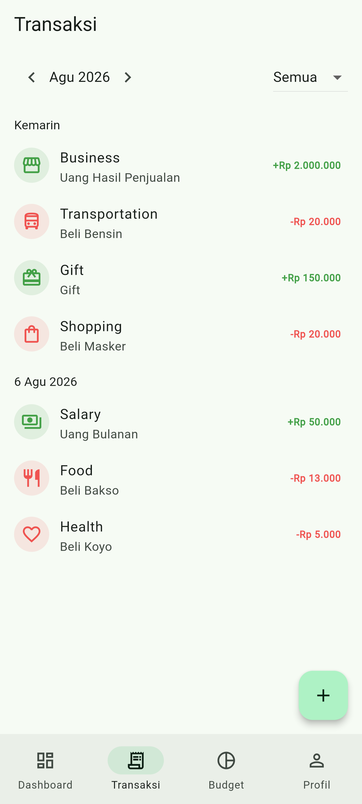
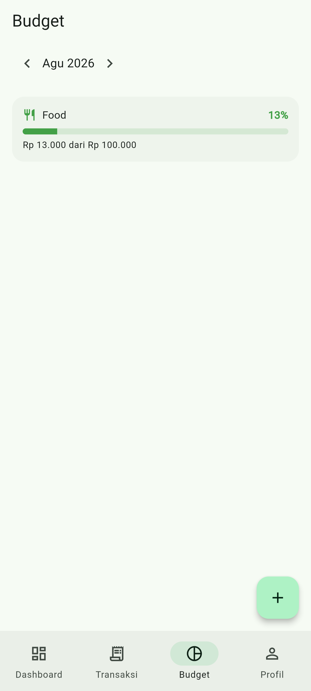
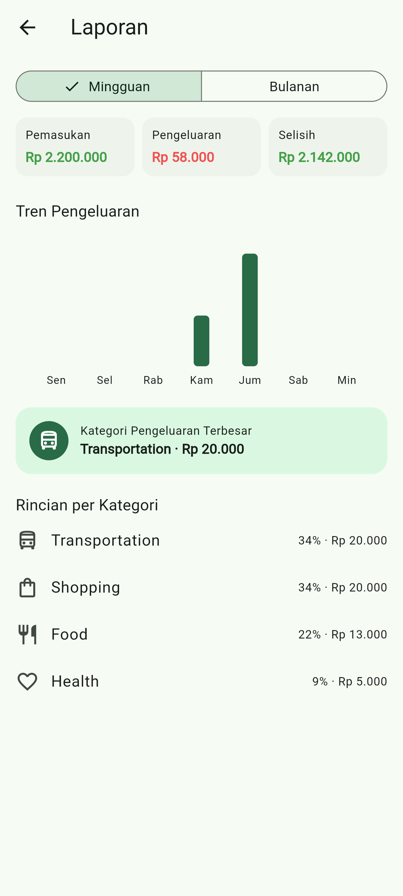
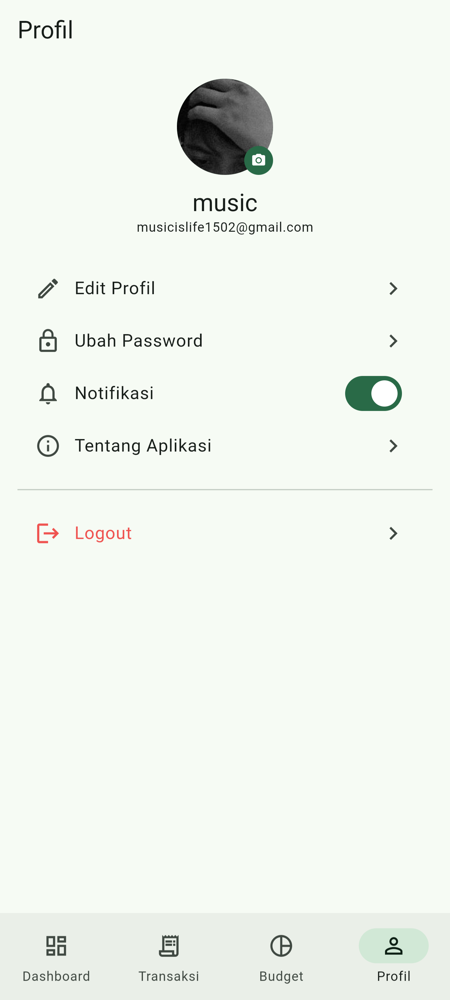

# FinTrack 💰

Aplikasi manajemen keuangan pribadi modern — dibangun dengan Flutter & Firebase, dirancang untuk mahasiswa dan pekerja muda yang ingin mengatur keuangan tanpa ribet.

> Portofolio proyek pribadi — Mahasiswa Informatika.

---

## 📱 Screenshots

<!-- Ganti placeholder di bawah dengan screenshot asli. Simpan gambar di folder screenshots/ dengan nama file yang sama. -->

| Login | Dashboard | Tambah Transaksi |
|---|---|---|
|  |  |  |

| Transaksi | Budget | Laporan |
|---|---|---|
|  |  |  |

| Profile |
|---|
|  |

---

## ✨ Fitur

- **Authentication** — Register, Login, Logout, Forgot Password (Firebase Auth)
- **Dashboard** — Total saldo real-time, ringkasan pemasukan/pengeluaran bulan berjalan, grafik donut pengeluaran per kategori, transaksi terakhir
- **Transaction Management** — CRUD transaksi lengkap, filter per bulan & tipe, swipe-to-delete dengan Undo
- **Category Management** — 12 kategori default (income & expense) lengkap dengan ikon
- **Budget Management** — Atur limit bulanan per kategori, progress bar real-time (hijau/kuning/merah), anti-duplikasi kategori
- **Financial Report** — Toggle mingguan/bulanan, grafik tren, kategori pengeluaran terbesar, drill-down ke daftar transaksi
- **Profile** — Edit nama, foto profil (disimpan sebagai base64 di Firestore — **tanpa Firebase Storage berbayar**), ubah password, toggle notifikasi, logout

---

## 🛠️ Tech Stack

| Kategori | Teknologi |
|---|---|
| Frontend | Flutter (Dart), Material 3 |
| State Management | Riverpod |
| Backend | Firebase (Authentication, Cloud Firestore) |
| Grafik | fl_chart |
| Arsitektur | Clean Architecture, feature-based |
| Testing | flutter_test, mocktail |

**Catatan:** proyek ini sengaja **tidak menggunakan Firebase Storage** (kini wajib paket berbayar/Blaze). Foto profil dikompres ke ukuran kecil dan disimpan sebagai base64 langsung di dokumen Firestore — tetap gratis di Spark plan. Detail lengkap di [bagian Keputusan Desain](#-keputusan-desain-penting).

---

## 🏗️ Arsitektur

Clean Architecture dengan struktur feature-based — tiap fitur punya 3 lapisan independen:

```
presentation/  →  UI (halaman, widget) + Riverpod providers
      ↓
domain/        →  Business logic murni (entity, use case, repository interface)
                   TIDAK bergantung ke Flutter atau Firebase sama sekali
      ↑
data/          →  Implementasi nyata ke Firestore (model, data source, repository impl)
```

**Aturan arah ketergantungan:** `presentation → domain ← data`. Domain layer tidak pernah tahu bahwa di baliknya ada Firebase — ini yang membuat business logic (perhitungan saldo, validasi, progress budget) bisa di-unit-test tanpa mock Firebase sama sekali.

---

## 📂 Struktur Folder

```
lib/
├── core/               # constants, theme, utils, error handling — dipakai lintas fitur
├── shared/             # widget & model generic (Result<T> wrapper, app shell/nav)
└── features/
    ├── authentication/ # Register, Login, Logout, Forgot Password
    ├── dashboard/       # Ringkasan keuangan real-time
    ├── transaction/     # CRUD transaksi + kategori
    ├── budget/           # Atur & pantau budget per kategori
    ├── report/           # Laporan mingguan/bulanan
    └── profile/          # Profil user
```

Setiap folder fitur konsisten: `domain/` (entities, repositories, usecases), `data/` (models, datasources, repositories), `presentation/` (providers, widgets, pages).

---

## 🗄️ Struktur Data (Firestore)

```
users/{uid}          → profile: name, email, photoUrl (base64), settings
transactions/{id}    → userId, amount, type, category, description, date
budgets/{id}         → userId, category, limitAmount, month ("YYYY-MM")
```

Progress budget **tidak disimpan** — selalu dihitung ulang dari transaksi terkait, supaya tidak pernah basi. Security Rules memastikan setiap user hanya bisa mengakses datanya sendiri (lihat `firestore.rules`).

---

## 🚀 Instalasi & Menjalankan

### Prasyarat
- Flutter SDK (stable channel)
- Akun Firebase + Firebase CLI (`npm install -g firebase-tools`)
- FlutterFire CLI (`dart pub global activate flutterfire_cli`)

### Langkah

```bash
git clone <url-repo-kamu>
cd fintrack
flutter pub get

# Hubungkan ke Firebase project kamu sendiri
flutterfire configure

# Deploy Security Rules & index
firebase deploy --only firestore:rules,firestore:indexes

flutter run
```

Aktifkan **Authentication (Email/Password)** dan **Cloud Firestore** di Firebase Console sebelum menjalankan. **Firebase Storage tidak perlu diaktifkan.**

---

## 🧪 Testing

```bash
flutter test
```

Unit test menutupi seluruh logic bisnis murni: perhitungan dashboard, progress budget, ringkasan laporan, kompresi foto, dan validasi input — semuanya tanpa perlu Firebase Emulator karena domain layer memang dirancang bebas dependency eksternal.

---

## 💡 Keputusan Desain Penting

- **Tanpa Firebase Storage** — foto profil dikompres (maks 300px, JPEG kualitas adaptif) lalu disimpan sebagai base64 di field `photoUrl` pada dokumen Firestore. Menghindari kebutuhan paket berbayar Blaze, tetap dalam batas gratis Firestore (dokumen < 1MB).
- **Progress budget dihitung, bukan disimpan** — dihitung ulang dari data transaksi setiap kali dibutuhkan, sehingga tidak ada risiko data "basi" antara budget dan transaksi aktual.
- **Dashboard & Report tanpa data layer sendiri** — keduanya murni mengolah ulang data dari fitur transaction lewat use case murni (`CalculateDashboardSummaryUseCase`, `CalculateReportSummaryUseCase`), menghindari duplikasi query Firestore.
- **Result<T> wrapper** — semua operasi repository mengembalikan `Success`/`ResultFailure`, bukan melempar exception mentah, sehingga UI selalu menampilkan pesan error yang ramah pengguna.

---

## 🔮 Pengembangan Selanjutnya

- Kategori transaksi kustom per user
- Recurring transaction (transaksi berulang otomatis)
- Export laporan ke PDF/Excel
- Notifikasi saat mendekati limit budget
- Dark mode
- Multi-currency

---

## 👤 Author

Dibangun sebagai proyek portofolio pribadi.

<!-- Tambahkan nama, LinkedIn, atau kontak kamu di sini -->

---

## 📄 Lisensi

Proyek ini dibuat untuk keperluan portofolio/pembelajaran.